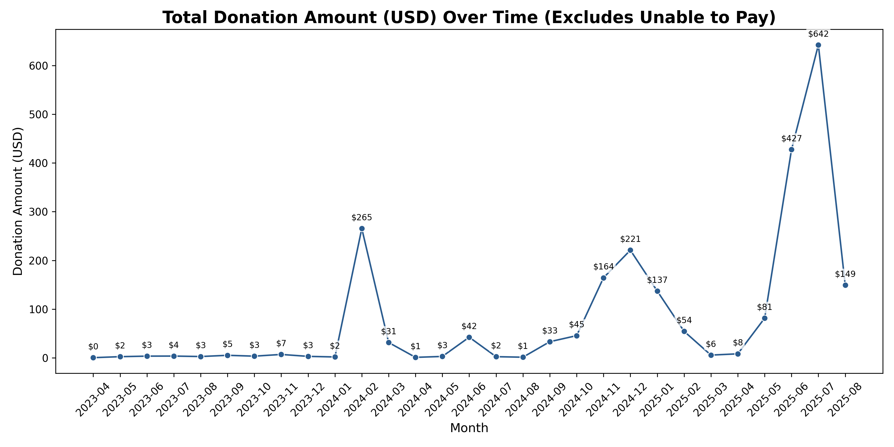
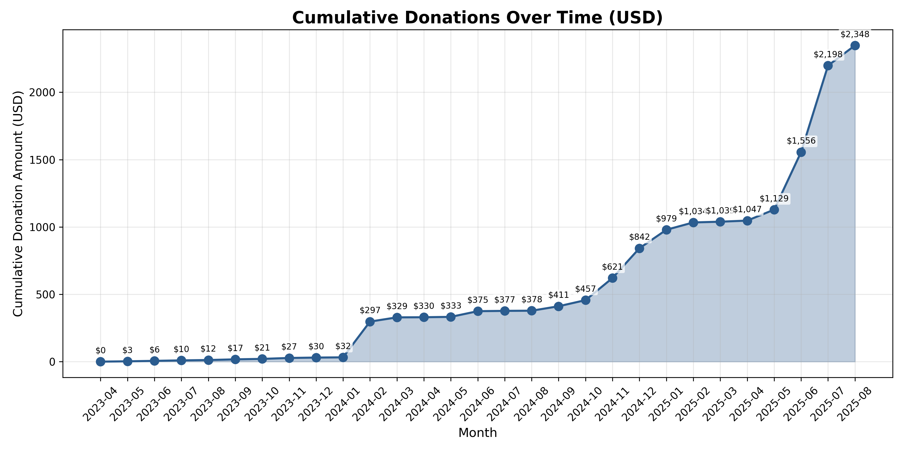
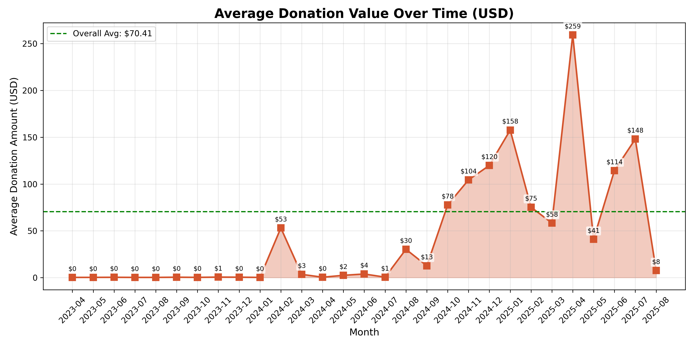
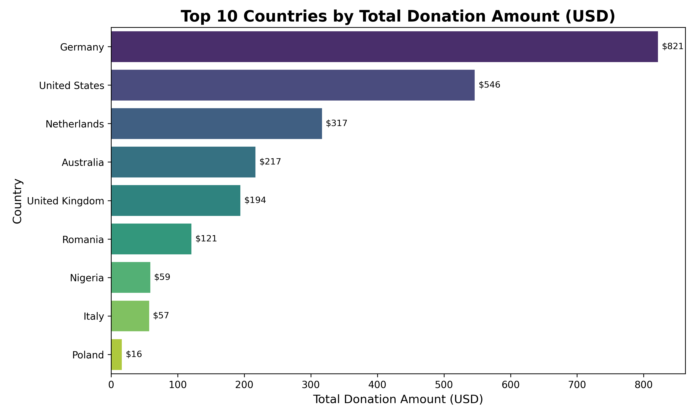
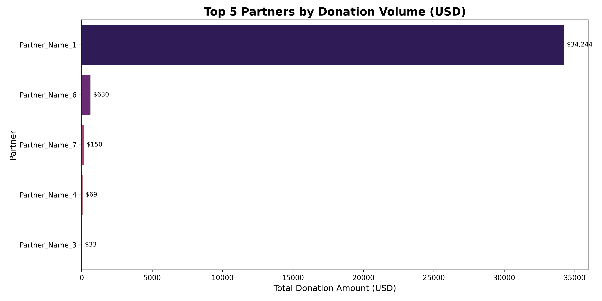
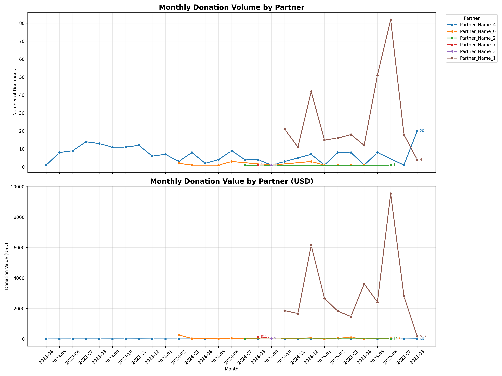
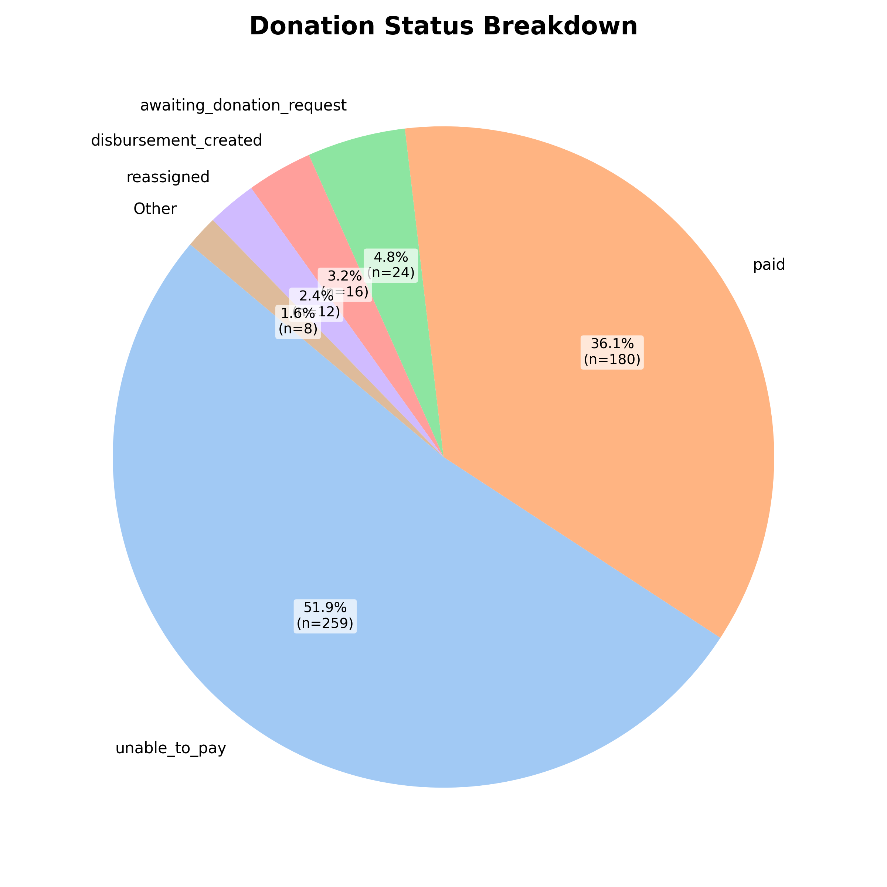
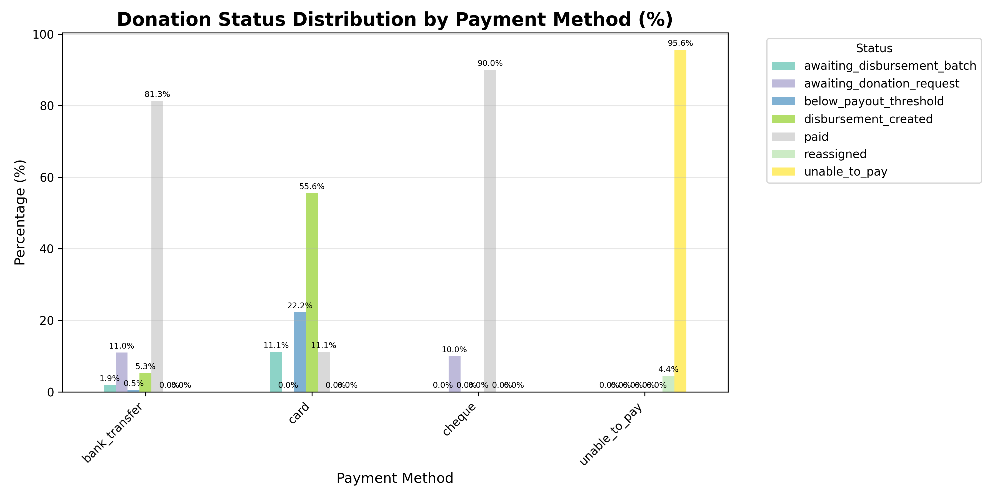
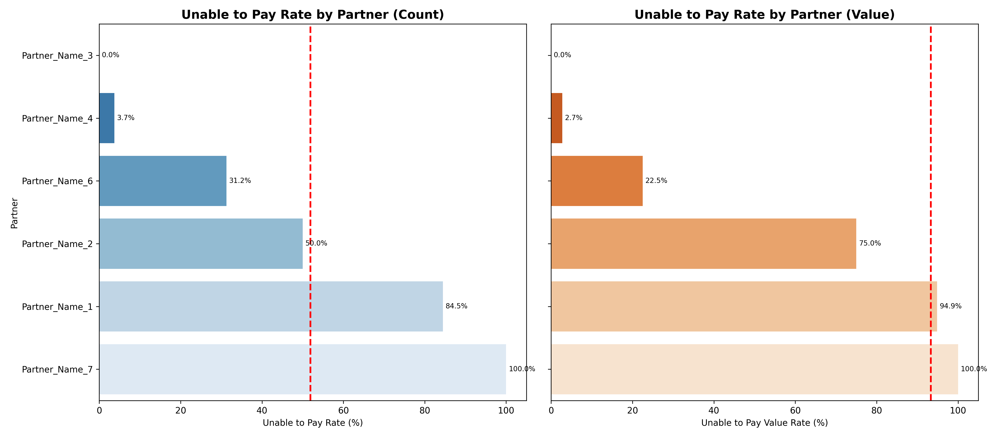

# Goodstack Leadership Performance Report

## Context and Objective
This report summarizes exploratory analysis of recent donation performance to help leadership understand overall trends, highlight operational risks, and prioritize next actions.

## Executive Summary
- Total donation records analyzed: 499
- Total donation value: $35,133.77
- Average donation value: $70.41
- Peak donation month (by value): 2025-06 with $9,604.54
- Most significant issue: `unable_to_pay` represents 259 records (51.90% of donations) and $32,786.01 (93.32% of total donation value)

The current portfolio shows strong top-line donation activity, but outcomes are heavily constrained by failed conversion to successful payment states.

## 1) Overall Trends in Donations Over Time
### What we see
- Donation value shows clear month-to-month volatility rather than a smooth linear pattern.
- Activity builds materially through late 2024 and peaks in June 2025.
- Cumulative donation trend rises over time, but this is dominated by records with unresolved payment status.

### Why it matters
- The business appears to be generating demand and donation intent.
- The core bottleneck is payment realization, not necessarily top-of-funnel donation generation.

### Visuals

## 2) Geographic and Partner Concentration
### What we see
Top 5 countries by donation value:
1. United Kingdom: $10,918.21
2. Australia: $9,849.51
3. Germany: $4,785.98
4. Romania: $3,046.42
5. Netherlands: $2,155.67

Top partner by far:
- Partner_Name_1: $34,244.02 out of $35,133.77 total

### Why it matters
- Revenue/donation concentration risk is very high by partner.
- Geographic concentration is moderate to high in a small set of markets.

### Visuals

## 3) Donation Status and `unable_to_pay` Risk (Priority Concern)
### Current state
- `unable_to_pay` count: 259 records
- `unable_to_pay` count share: 51.90%
- `unable_to_pay` value: $32,786.01
- `unable_to_pay` value share: 93.32%
- `paid` count: 180 records (36.07%)

### Interpretation
- More than half of donation records are not progressing to successful payment.
- The highest-value portion of the portfolio is disproportionately tied to `unable_to_pay`, creating a major conversion and cash-realization issue.
- This is likely the single largest performance lever available to leadership.

### Visuals

## 4) Leadership Priorities and Recommended Actions
### Priority 1: Reduce `unable_to_pay` quickly
- Launch a 2-week root-cause review segmented by partner, country, and payment method.
- Instrument failure reasons into explicit categories (insufficient funds, payment rail failure, compliance/KYC hold, customer action required, etc.).
- Set a near-term target: reduce `unable_to_pay` count rate from 51.9% to <40% in the next cycle.

### Priority 2: Improve conversion funnel from donation intent to paid
- Introduce retry logic and reminder workflows for recoverable failures.
- Add partner-level and market-level alerting for sudden spikes in failure rate.
- Track weekly operational KPI pack: `unable_to_pay` count rate, value rate, recovery rate, and paid conversion lag.

### Priority 3: De-risk partner concentration
- Partner_Name_1 currently dominates donation value, increasing exposure to a single-channel risk.
- Build diversification targets across additional partners and monitor share-of-value concentration monthly.

## 5) Suggested KPI Scorecard for Leadership
Track these weekly and monthly:
1. Total donation count and total donation value
2. Paid conversion rate (count and value)
3. `unable_to_pay` rate (count and value)
4. Recovered value from previously `unable_to_pay` records
5. Top partner concentration (% of total value)
6. Top 5 country concentration (% of total value)

## Closing Note
Performance trends indicate strong donation activity potential, but business outcomes are currently constrained by payment realization. Closing the `unable_to_pay` gap is the fastest path to improving realized impact and financial performance.
